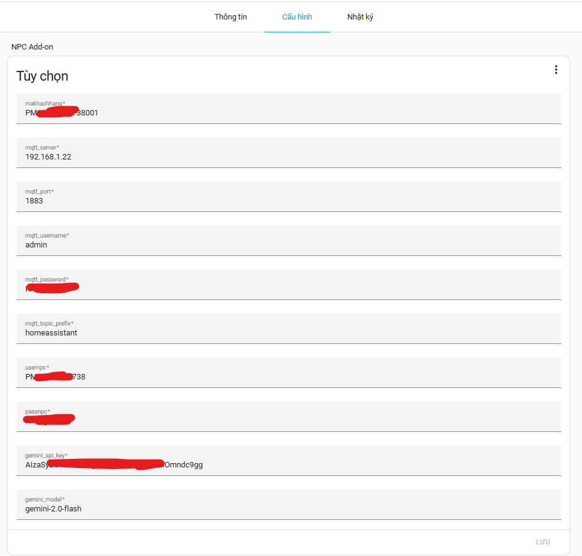
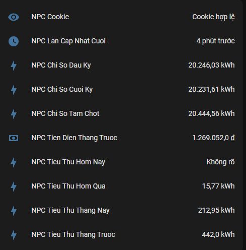
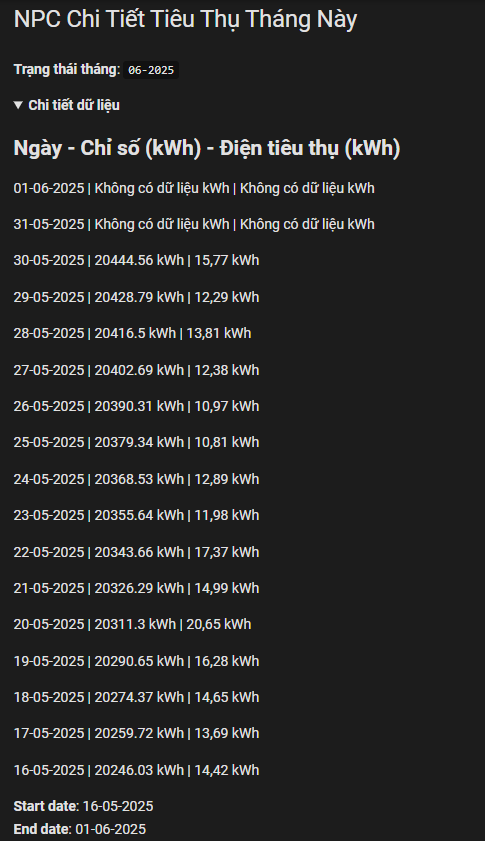

# 🔌 NPC Miền Bắc

Công cụ tự động đăng nhập vào website CSKH NPC (miền Bắc), lấy dữ liệu điện tiêu thụ & tiền điện, và gửi qua MQTT về Home Assistant.

- ✅ Không cần đăng nhập thủ công
- ✅ Hỗ trợ MQTT Discovery (Home Assistant nhận dạng tự động)

---

## 🚀 Cách sử dụng

### 1. Tạo cấu hình

```ini
makhachhang=điền mã điểm đo(đăng nhập vào npc rồi lấy dữ liệu tiêu thụ là thấy mã điểm đo)
mqtt_server=
mqtt_port=1883
mqtt_username=
mqtt_password=
mqtt_topic_prefix=homeassistant
usernpc=tài khoản npc
passnpc=mật khẩu npc
gemini_api_key=key api gemini
gemini_model=gemini-2.0-flash

```

> Bạn cần có tài khoản [Google Gemini](https://makersuite.google.com/app/apikey) để lấy `gemini_api_key`.

---

## 📡 Kết quả

Sau khi khởi chạy lần đầu sẽ mất chút thời gian để lấy dữ liệu, các cảm biến sẽ xuất hiện trong Home Assistant nhờ MQTT Discovery:

- `NPC Tieu Thu Hom Nay`
- `NPC Tien Dien Thang Truoc`
- `NPC Chi So Cuoi Ky`
- Và nhiều cảm biến khác

---
## Hiển Thị Cảm Biến Trên Home Assistant

- Chi Tiết Tiêu Thụ Các Ngày Trong Tháng
```yaml
type: markdown
title: NPC Chi Tiết Tiêu Thụ Tháng Này
content: >
  **Trạng thái tháng**: `{{
  states('sensor.npc_chi_tiet_dien_tieu_thu_thang_nay') }}`


  <details>
    <summary><strong>Chi tiết dữ liệu</strong></summary>
    
    Ngày         - Chỉ số (kWh)     - Điện tiêu thụ (kWh)
    -
    
    {{ d['Ngày'] }} | {{ d['Chỉ số'] }} kWh | {{ d['Điện tiêu thụ (kWh)'] }} kWh
    

    **Start date**: {{ state_attr('sensor.npc_chi_tiet_dien_tieu_thu_thang_nay','start_date') }}  
    **End date**: {{ state_attr('sensor.npc_chi_tiet_dien_tieu_thu_thang_nay','end_date') }}
  </details>``
```

- Các cảm biến khác
```yaml
type: entities
entities:
  - sensor.npc_cookie
  - sensor.npc_lan_cap_nhat_cuoi
  - sensor.npc_chi_so_dau_ky
  - sensor.npc_chi_so_cuoi_ky
  - sensor.npc_chi_so_tam_chot
  - sensor.npc_tien_dien_thang_truoc
  - sensor.npc_tieu_thu_hom_nay
  - sensor.npc_tieu_thu_hom_qua
  - sensor.npc_tieu_thu_thang_nay
  - sensor.npc_tieu_thu_thang_truoc
```

---

## 🖼️ Demo

<details>
  <summary><strong>Xem ảnh minh họa</strong></summary>

  
  
  

</details>

---

## ❓ Câu hỏi thường gặp

#### Q: Có cần tài khoản NPC không?
> A: Cần. Bạn phải đăng ký tài khoản tại: https://cskh.npc.com.vn

#### Q: Dữ liệu có tự động cập nhập không?
> A: Có, dữ liệu sẽ tự động thu thập & gửi dữ liệu mỗi 120 phút.

#### Q: Có log không?
> A: Có. Bạn có thể xem tại tab logs.

---

## ❤️ Đóng góp

Nếu bạn có câu hỏi hoặc muốn cải tiến, hãy mở [Issue](https://github.com/smarthomeblack/hass-addon/npc/issues) hoặc gửi PR.


